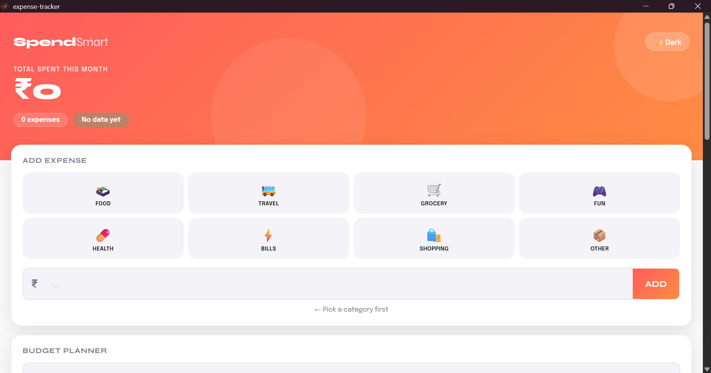
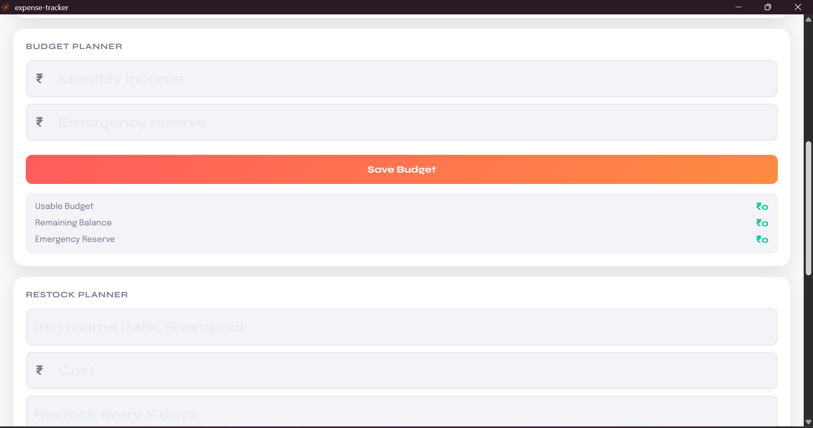
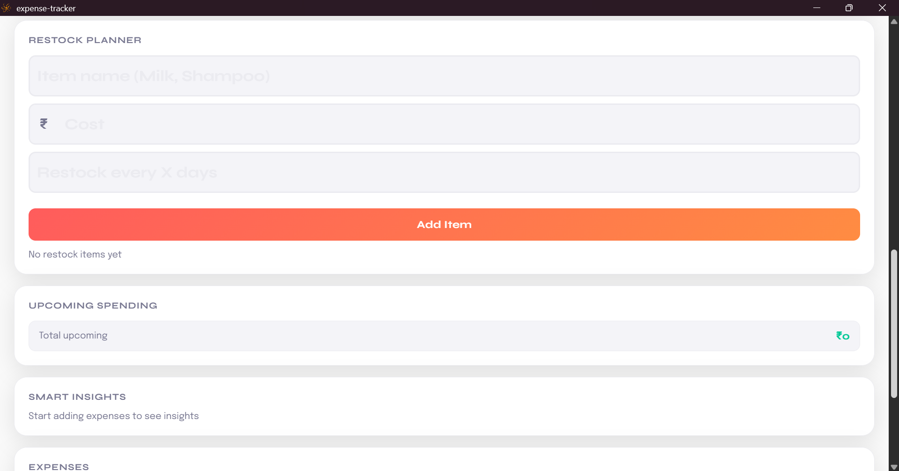
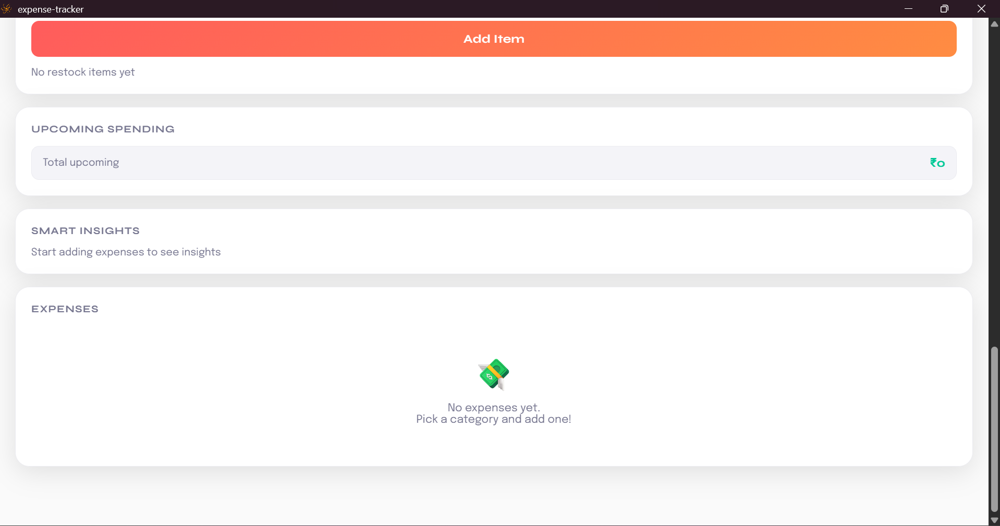
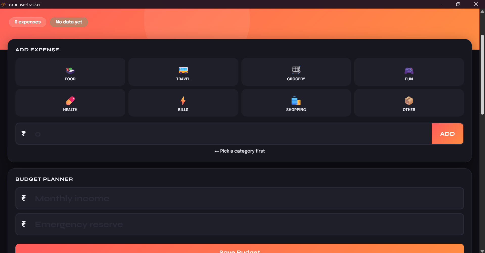

# SpendSmart 💸

AI-powered expense tracker designed for students.

---

## 🚀 Features

- Expense tracking
- Budget planning with emergency reserve
- Restock reminders
- Smart spending alerts
- Upcoming expense prediction

---

## 💡 What makes it unique?

SpendSmart doesn't just track expenses —  
it helps you **plan future spending**.

- Predicts upcoming purchases  
- Helps prepare money in advance  
- Prevents overspending  

---

## 🛠 Tech Stack

- HTML
- CSS
- JavaScript
- Neutralino.js

---

## 📸 Screenshots

  
  
  
  
  

## 👩‍💻 Author

Ananya Sinha
